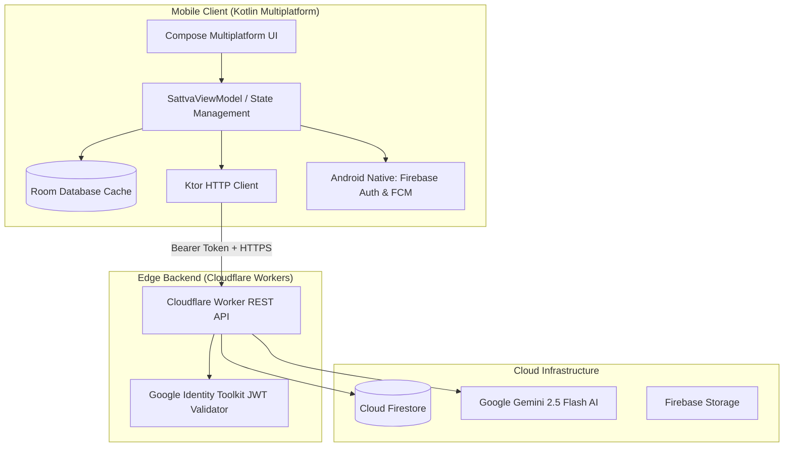

# Utsavam (उत्सवम्)

> **A modern, spiritual platform connecting devotees with sacred Gaushalas, animal welfare sanctuaries, daily Vedic wisdom, and AI-guided spiritual guidance.**

Built with **Kotlin Multiplatform (KMP)**, **Compose Multiplatform UI**, and powered by a serverless **Cloudflare Worker Edge Backend** backed by **Firebase** and **Google Gemini AI**.

---

## 🌟 Key Features

* 🪷 **Gaushala Sanctuary Discovery**: Explore certified Gaushalas and animal shelters across India with transparent trust scores, audit tiers, and live updates.
* 🐂 **Animal Resident Seva**: Support specific rescued cows and bulls (e.g., Nandi) with targeted medical, fodder, or shelter seva contributions.
* 🕉️ **Daily Panchang & Vedic Wisdom**: Real-time Tithi, Nakshatra, Paksha, Abhijit Muhurta timings, and curated Sanskrit verses from the Bhagavad Gita.
* 🤖 **Vedic AI Spiritual Assistant**: Intelligent AI companion powered by Google Gemini 2.5 Flash for personalized Sankalpa generation, Vedic rituals, and scripture inquiries.
* 📊 **Transparent Welfare Tracking**: Real-time tracking of sanctuary donations, meals served, and rescued animal counts.
* 📱 **Offline-First & Cloud-Synced**: Local Room database caching with seamless cloud synchronization to Firebase Firestore.

---

## 🏗️ Architecture Overview



---

## 🛠️ Technology Stack

### **Client (Android & iOS Shared)**
* **Language & Framework**: Kotlin 2.1+, Kotlin Multiplatform (KMP), Compose Multiplatform
* **UI & Design**: Material 3 + Custom Aaryam Vedic Design System
* **Local Persistence**: AndroidX Room KMP Database (`@ConstructedBy`, SQLite)
* **Networking**: Ktor 3 Client (`io.ktor:ktor-client-core`, `content-negotiation`, `kotlinx-serialization`)
* **Image Loading**: Coil 3 Compose
* **Platform Integrations**: Firebase Authentication, Cloud Firestore, Firebase Cloud Messaging (FCM), Firebase Storage

### **Backend (Cloudflare Edge Worker)**
* **Runtime**: Cloudflare Workers (TypeScript)
* **AI Engine**: Google Gemini API (`gemini-2.5-flash`)
* **Database & Auth**: Cloud Firestore REST API, Google Identity Toolkit REST API
* **Deployment Tooling**: Cloudflare Wrangler CLI

---

## 📁 Repository Structure

```text
.
├── androidApp/          # Android entry point, AndroidManifest, Gradle runner
├── shared/              # Kotlin Multiplatform shared module
│   ├── commonMain/      # Compose UI, ViewModels, Room DB, Ktor network repositories
│   ├── androidMain/     # Android native platform implementations (Firebase Auth/FCM)
│   └── iosMain/         # iOS framework entry point
├── backend/             # Cloudflare Worker REST API
│   ├── src/             # TypeScript worker handlers & auth validators
│   ├── wrangler.jsonc   # Worker configuration & environment variables
│   └── API.md           # Backend REST API documentation
├── gradle/              # Gradle wrapper & dependency catalog (libs.versions.toml)
└── build.gradle.kts     # Root build configuration
```

---

## 🚀 Getting Started

### Prerequisites
* **Android Studio**: Ladybug / Koala or newer (with Kotlin Multiplatform plugin)
* **JDK**: Java 21
* **Node.js**: v18+ (for backend deployment)
* **Gradle**: 9.3.1 (configured via included `./gradlew`)

---

### Running the Android App

> [!IMPORTANT]
> Always open the **root repository folder** (`/Sattva`) in Android Studio — do **not** open the `androidApp/` subfolder directly.

1. **Clone the Repository**:
   ```bash
   git clone https://github.com/marvelpokemaster/Sattva.git
   cd Sattva
   ```
2. **Open in Android Studio**:
   * Select **File** → **Open...** → choose the `Sattva` root directory.
   * Allow Gradle to sync.
3. **Run**:
   * Select **`androidApp`** in the run configurations dropdown.
   * Press **Run (▶)** to deploy to an emulator or connected device.

---

### Building the APK via CLI

* **Build Debug APK**:
  ```bash
  ./gradlew :androidApp:assembleDebug
  ```
  *Output:* `androidApp/build/outputs/apk/debug/androidApp-debug.apk`

* **Build Release APK**:
  ```bash
  ./gradlew :androidApp:assembleRelease
  ```
  *Output:* `androidApp/build/outputs/apk/release/androidApp-release-unsigned.apk`

---

### Deploying the Cloudflare Backend

1. **Navigate to backend**:
   ```bash
   cd backend
   ```
2. **Set up secrets (Gemini API Key)**:
   ```bash
   npx wrangler secret put GEMINI_API_KEY
   ```
3. **Deploy to Cloudflare Workers**:
   ```bash
   npx wrangler deploy
   ```

Live Backend Base URL: `https://utsavam-backend.utsavam-api.workers.dev`

---

## 📖 API Reference

Detailed API documentation is available in [backend/API.md](file:///home/marvelpokemaster/antigravity/Sattva/backend/API.md).

| Method | Endpoint | Auth Required | Description |
|---|---|---|---|
| `GET` | `/api/v1/health` | No | Service health check |
| `GET` | `/api/v1/catalog/gaushalas` | No | List gaushalas (supports `?city=`) |
| `GET` | `/api/v1/catalog/animals` | No | List animals (supports `?gaushalaId=`) |
| `GET` | `/api/v1/welfare` | No | System-wide impact statistics |
| `POST` | `/api/v1/ai/ask` | No | Ask spiritual / ritual question to Gemini AI |
| `GET` | `/api/v1/profile` | Yes (Bearer) | Get authenticated user profile |
| `PUT` | `/api/v1/profile` | Yes (Bearer) | Update user profile |
| `GET` | `/api/v1/donations` | Yes (Bearer) | Get user's seva contribution history |
| `POST` | `/api/v1/donations` | Yes (Bearer) | Create new seva contribution |

---

## 🔒 Security & Privacy
* Client requests to authenticated endpoints pass Firebase ID Tokens in the standard `Authorization: Bearer <TOKEN>` header.
* Edge Worker verifies token authenticity against Google Identity Toolkit endpoints before querying or mutating user-scoped Firestore documents.
* API keys and secrets are securely configured via Cloudflare Workers Secrets and not exposed in client bundles.
